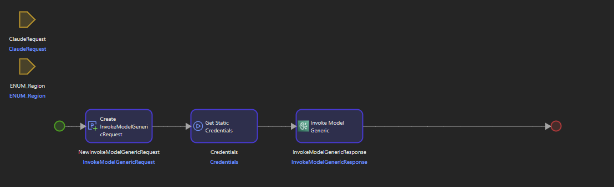
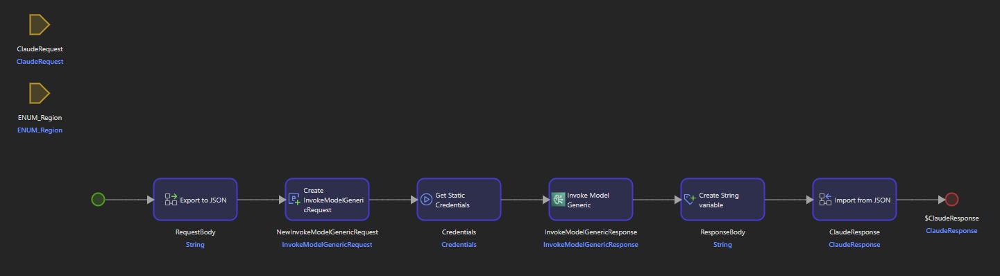

# Lab 4. Integrating Amazon Bedrock into a Mendix app

## Overview

Welcome to the Mendix Amazon Bedrock Lab!

This Lab has been designed to help you get started with using Mendix with [Amazon Bedrock](https://aws.amazon.com/de/bedrock/). After completing this lab, you will have the knowledge required to use the [Mendix Amazon Bedrock connector](https://marketplace.mendix.com/link/component/215042) to invoke generative AI models from your mendix application and display their responses. In this lab we will focus on the `Claude` and `Stable Diffusion` models. However, you will be able to apply the knowledge from this lab to also use other models available on Amazon Bedrock. 

This lab provides a Mendix module that uses Amazon Textract as starting point. If you want to learn how to use the Mendix Amazon Textract Connector yourself, you cam visit Lab 1.

You will be using the following key services:
- [Amazon Bedrock](https://aws.amazon.com/de/bedrock/)
- [Amazon Textract](https://aws.amazon.com/de/textract/)

**This lab assumes that you already have some knowledge of AWS, an AWS account, and a Mendix account**

You can sign up for a free Mendix account here: [Sign-up for free!](https://signup.mendix.com/index.html)

You can create an AWS Account and access AWS Free Tier Offers here: [Learn more and crate a Free Account](https://aws.amazon.com/en/free/?all-free-tier&all-free-tier.sort-by=item.additionalFields.SortRank&all-free-tier.sort-order=asc&awsf.Free%20Tier%20Types=*all&awsf.Free%20Tier%20Categories=*all)

## Workshop Outline

- [Lab 4. Integrating Amazon Bedrock into a Mendix app](#lab-4-integrating-amazon-bedrock-into-a-mendix-app)
  - [Overview](#overview)
  - [Workshop Outline](#workshop-outline)
  - [1. Create a new Mendix project](#1-create-a-new-mendix-project)
    - [Start Mendix Studio Pro](#start-mendix-studio-pro)
  - [2. Import the AWS Connectors](#2-import-the-aws-connectors)
    - [Import AWS Authentication Connector](#import-aws-authentication-connector)
    - [Import Amazon Textract Connector](#import-amazon-textract-connector)
    - [Import Amazon Bedrock Connector](#import-amazon-bedrock-connector)
    - [Confirm the imports](#confirm-the-imports)
  - [3. Configure the AWS Credentials](#3-configure-the-aws-credentials)
    - [Configure static credentials in the Mendix App](#configure-static-credentials-in-the-mendix-app)
    - [Configure temporary credentials in the Mendix App](#configure-temporary-credentials-in-the-mendix-app)
  - [4. Import and configure the Starting-Point.](#4-import-and-configure-the-starting-point)
    - [Configure the navigation](#configure-the-navigation)
    - [Test the imported functionality](#test-the-imported-functionality)
  - [5. Create the logic to implement the Claude model](#5-create-the-logic-to-implement-the-claude-model)
    - [Inspect the Bedrock Connector](#inspect-the-bedrock-connector)
    - [Build the Claude-specific logic](#build-the-claude-specific-logic)
  - [6. Extend the application with Bedrock and Claude](#6-extend-the-application-with-bedrock-and-claude)
    - [Build the logic](#build-the-logic)
    - [Extend the page](#extend-the-page)
    - [Run the app](#run-the-app)
  - [7. Bonus Chapter: Integrate Stable Diffusion to create Images based on the summary](#7-bonus-chapter-integrate-stable-diffusion-to-create-images-based-on-the-summary)
    - [Additional prerequisites](#additional-prerequisites)
    - [Building the StableDiffusion request and response entities](#building-the-stablediffusion-request-and-response-entities)
    - [Build the Microflow to invoke Stable DIffusion XL](#build-the-microflow-to-invoke-stable-diffusion-xl)
    - [Extend the Smart Notes Summarizer app](#extend-the-smart-notes-summarizer-app)
    - [Extending the page](#extending-the-page)
    - [Run the app and generate images](#run-the-app-and-generate-images)

## 1. Create a new Mendix project

In this lab. you will first create a new Mendix application. Later, you will import a module as a starting point, that you will extend by implementing Amazon Bedrock into the application. To follow this lab, it is required to have **Mendix Studio Pro version 10.4.1** or newer installed. You can download the latest Studio Pro Version here: [Get Mendix Studio Pro!](https://marketplace.mendix.com/link/studiopro/)

### Start Mendix Studio Pro

To start Mendix Studio Pro and create a new application follow these steps:

1. Launch **Mendix Studio Pro** by double-clicking the desktop-icon or via the start menu.
2. If you are not signed into your Mendix account yet, you will be prompted to do so. Please follow the steps to complete the web sign-in and then come back to Studio Pro.
3. In Studio Pro, choose **Create New App**.
4. Now you will need to choose a starting point. Select **Blank Web App** and then click **Use this starting point**.

5. In the **App settings** popup, enter `AWSBedrockLab` as **App name**. Then click **Create app**.

Now your project will be created. This can take a moment. Once it's done, the project will be automatically openend in Studio Pro. 

## 2. Import the AWS Connectors

In order to enable Mendix Makers to easily integrate AWS services into their Mendix apps, Mendix has built a suite of connectors that are generally available in the [Mendix Marketplace](https://marketplace.mendix.com/). In this lab, you will make use of the following connector:

- [AWS Authentication Connector](https://marketplace.mendix.com/link/component/120333). This module is a prerequisite for every AWS Connector and provides everything you need regarding authentication with AWS.
- [Amazon Textract Connector](https://marketplace.mendix.com/link/component/205646). This module is used to integrate with the Amazon Texract Service. It is required by the Starting-Point module that you will be working on and that we will import in a bit.
- [Amazon Bedrock Connector](https://marketplace.mendix.com/link/component/215042). The Amazon Bedrock Connector will be the main building block to allow using Bedrock from within your Mendix application. 

### Import AWS Authentication Connector

1. Click the shopping cart icon on the top right hand side corner of Studio Pro to open the **Mendix Marketplace**.
2. In the search field, enter `AWS Authentication Connector` and click on the first search result.
3. A new tab with the detail page of the connector opens in the main section of Studio Pro.

4. Click **Download**, click **Import** on the popup that opens and afterwards confirm the information message by clicking **OK**.
5. If you get a warning popup about overwriting files, click **Continue**.

### Import Amazon Textract Connector

1. Navigate to the Mendix Marketplace again and search for `Amazon Textract Connector`.
2. Follow the same steps as above to import the connector into your project

### Import Amazon Bedrock Connector

1. Navigate to the Mendix Marketplace again and search for `Amazon Bedrock Connector`.
2. Follow the same steps as above to import the connector into your project.

### Confirm the imports

To verify that you imported the required connectors successfully into you application, you can follow these steps:

1. In the **App Explorer** on the left pane of Studio Pro, expand the `App AWSBedrockLab` section.
2. Expand the `Marketplace modules section`
3. Confirm that you find the **AWS Authentication Connector**,**Amazon Textract Connector** and **Amazon Bedrock Connector** listed as marketplace modules.

## 3. Configure the AWS Credentials

For more information on setting up AWS Credentials, please refer to the `AWS Authentication Configuration` page in the `Prerequistes` section of this workshop.

**Make sure that your credentials have access to the Amazon Textract and Amazon Bedrock Services.**

To be able to use AWS Services from your Menidx App, you need to configure **either** static or temporary credentials. The following two sections will guide you how to set up both variants. Remeber that you need to choose only one of them. 

**Static Credentials** are easier to set up. **Temporary Credentials** require a few more steps to set up, but are the recommended way of authenticating to AWS in a production application. 

### Configure static credentials in the Mendix App

To set up static credentials follow these steps:

1. In the **App Explorer**, expand the `App AWSBedrockLab` section.
2. Double-click **Settings** to open the App Settings in a popup.
3. We need to create a new configuration profile. Make sure, that the `Configurations`-tab is opened (should be opened by default).
4. Click **New** to create a new configuration, which will open in a popup.
5. Give it a name, for example `AWS`.
6. Navigate to the `Constants`-tab and click **New**.
7. In the search field, type `AccessKey`, select the `AccessKey` constant of the **AWSAuthenticationConnector** and click **Select**.
8. In the popup that opens, enter your Access Key in the `Value` field and confirm with **OK**.
9.  Click **New** one more time and this time search for `SecretAccessKey`, select the `SecretAccessKey` constant of the **AWSAuthenticationConnector** and click **Select**.
10. Enter your Secret Access Key and click **OK**.
11. Click **OK** one more time to save the configuration.
12. Make sure, that your configuration is set to `Active`. You can confirm that by checking the the active column has a green check mark.
13. If it is not set to active, you need to select your newly created configuration and click the **Make active** button.
14. Click **Ok** to escape the App Settings.

### Configure temporary credentials in the Mendix App

To set up temporary credentials follow these steps:

1. In the **App Explorer**, expand the `App AWSBedrockLab` section.
2. Double-click **Settings** to open the App Settings in a popup.
3. We need to create a new configuration profile. Make sure, that the `Configurations`-tab is opened (should be opened by default).
4. Click **New** to create a new configuration, which will open in a popup.
5. Give it a name, for example `AWS`.
6. Now, you need to add a series of constants. For each, do the following:
   1. Navigate to the `Constants`-tab and click **New**.
   2. Search for the constant name. And select the constant that is located in the **AWSAuthenticationConnector** module.
      1. For **ClientCertificateID**, enter the value `1`.
      2. For **ProfileARN**, enter your **PROFILE_ARN.**
      3. For **RoleARN**, enter your **ROLE_ARN**.
      4. For **SessionName**, you can enter a custom value, for example `AWS_Mendix`.
      5. For **TrustAnchorARN**, enter your **TRUST_ANCHOR_ARN**.
7. Navigate to the `Custom`-tab of the `Edit Configuration` popup.
8. Add two custom variables for the local path of the pfx file and the password for your certificate file.
   1. On the Custom tab click **New** to create the variable
   2. Add one with the Name **ClientCertificatePasswords** and the password for your certificate file as Value.
   3. Add one with the Name **ClientCertificates** and the path to your certificate file as Value.
9. Close the Edit Configuration window by clicking **OK**.
10. Make sure, that your configuration is set to `Active`. You can confirm that by checking the the active column has a green check mark.
11. If it is not set to active, you need to select your newly created configuration and click the **Make active** button.
12. Click **Ok** to escape the App Settings.

## 4. Import and configure the Starting-Point.

The goal of this lab is to create an application where you can upload your handwritten notes, extract their information into the application and automatically create a summary of your notes. In the bonus chapter you will further enhance the app by generating an image based on the notes summary, to make the app look even nicer!

You won't be starting entirely from scratch, though. We've prepared a Starting-Point module that already covers some of the functionality and that you will be extending. The Starting-Point module already offers the functionality to upload your notes and extract their contents. This is done by using Amazon Textract. If your interested how to build something like this yourself, go ahead and take a look at lab 1 of this workshop, that is all about Mendix and Textract!

You can find the Starting-Point Module here: [BedrockLab_StartingPoint](/resources/StartingPointModule/BedrockLab_StartingPoint.mpk)

1. To import it into your app, right-click the **App Explorer** and select `Import module package`.

2. Select the `BedrockLab_StartingPoint` module in the location you saved it to.
3. Click **Import**.
4. Confirm any additional popup by clicking **OK**.
5. Now the module should be listed in the **App Explorer**.

### Configure the navigation

Before we can test the app, we need to change the default homepage, so that when opening the app, we directly see the page we are interested in. To do so follow these steps:

1. In the **App Explorer**, expand the `App AWSBedrockLab` section.
2. Double-click `Navigation` to open the Navigation page.
3. Under the `Home pages` section we can set a custom home page. Currently, it is set to `MyFirstModule.Home_Web`, which is a default page created by Mendix Studio Pro when initializing the project.
4. Click **Select** and search for `NotesExtraction_Home`. Select this page and click **Select**.
5. Confirm that the default home page is now set to `BedrockLab_StartingPoint.NotesExtraction_Home`.

### Test the imported functionality

Let's test and find out what the module provides us with:

To test, you can use this picture of some sample notes that have been taken during a meeting: [SampleNotes](/resources/SampleNotes/BedrockLab-sample-notes.jpg)

**Setting up the region and credentials for the pre-built functionality:**

The Amazon Textract implementation is already part of the `BedrockLab_StartingPoint` module. It defaults to **US-East-1** as the AWS region and **Static Credentials**. If this configuration works for you, then you can *skip this part*. If you are using Temporary Credentials or if you have access to Amazon Textract in a different AWS region, follow these steps:

1. To switch to Temporary Credentials:
   1. In the `BedrockLab_StartingPoint` module expand the **Resources** folder.

   2. Double-click the **UseStaticCredentials** Constant and set it's **DefaultValue** to *false*.
   3. Click **OK**

1. To change the AWS region:
   1. In the `BedrockLab_StartingPoint` module expand the **Resources** folder.

   2. Double-click the **Textract_AWS_Region** Microflow.
   3. This Microflow only has one AWS_Region variable. Double-click it to change it's value.
   4. Click **Generate** and then choose the required region from the dropdown.
   5. Click **OK**

**To run and test the project, follow these steps:**

1. Click the **Run Project** button on the top right hand side in Studio Pro.

1. Now the app is starting up locally. This will take moment.
2. Once it is ready, click the **View App** button to open the app in the browser. 
3. You should see the Smart Notes Summarizer Page.
4. Click the **Upload new notes** button.
5. In the popup, click **Browse** and upload the SampleNotes image.
6. Give the notes a name, for example `My Meeting Notes`.
7. Click **Analyze with Amazon Textract!**
8.  If everything ran successfully, you should now see `My Meeting Notes` on the left side of the page. When you click on it the fully extracted notes will be displayed on the right side of the page.

    
If you get an error, it has most likely to do with your credentials not being set up correctly or not having the required permissions. Please refer to the [Credentials section](#3-configure-the-aws-credentials-credentials). 

As you can see, the application already helps you to import your notes quickly. Now let's implement Amazon Bedrock to generate a summary!

## 5. Create the logic to implement the Claude model

Let's start building! Using the Amazon Bedrock Connector, you will create an implementation of Anthropic's Claude model, that can be used to generate a summary when new notes are imported into the app.

For a variety of models available in Bedrock, there is an Example Implementation Mendix module that can be found here: [Bedrock Example Implementation](https://marketplace.mendix.com/link/component/215751).

However, this Example Implementation might not be up to date at any time, so it is good to know how to implement a model yourself, with the help of the Amazon Bedrock Connector:

First of all, make sure you have access to at least one Claude model via Bedrock. You can perform the following steps to verify you have access:

1. Sign in to the AWS Console and navigate to the Bedrock Environment
2. In the menu on the left, click on `Model access`.
3. In the `Anthropic`-section, check that the Access status for the Claude or Claude Instant model is set to `Access granted`.

Let's navigate back to Mendix Studio Pro. 

The best way to store your custom Bedrock implementations is to create a new module for that. 
1. Right-click the **App Explorer** and select **Add module**.
2. Give your module a name, for example `BedrockImplementation`.
3. Confirm by clicking **OK**.
4. Take a look at the **App Explorer**. A new module has been created. By default it already has a **Domain Model** and **Settings**.

To organize the work better, let's create two folders in the newly created module. 
1. Right-click the `BedrockImplementation` (or the custom name you chose) module.
2. Select **Add Folder** and call it `Claude`.
3. Click **OK**.
4. Right-click the `Claude` folder.
5. Select **Add Folder**, call it `Resources` and confirm with **OK**.

This is the folder structure we will be working with for the Claude implementation. 

### Inspect the Bedrock Connector 

Expand the ***AmazonBedrockConnector** module, found in **App Explorer** --> **Marketplace modules**. In the **Operations** there is a Microflow called `POST_V1_InvokeModel_Generic`. This Microflow can be used to make a call to Amazon Bedrock and contains everything that is generic to all the models. We need to implement some additional logic around it that contains everything specific to the Claude model. 

Next, open the **Domain model** of the **AmazonBedrockConnector**. In the `Invoke Model` section there are two entities: `InvokeModelGenericRequest` and `InvokeModelGenericResponse`. These serve as request and response types of the Invoke Model operation. The request object has an attribute called `RequestBody`, whereas the response entity has an attribute called `ResponseBody`. The goal is to create some additional logic that let's us create a Claude-specific request body in a reusable way. Additionally, we want to find a way to handle the specific Claude-response body in a easy-to-use manner.

### Build the Claude-specific logic

Before we model the logic, we need to create entities for the Claude-specific request and response. To do so, navigate to the Navigate to the `BedrockImplementation` module in the **App Explorer** and open the **Domain model**. It should still be empty at this point.

Let's have a look at how the request body of the Claude model looks like:

    "body": {
        "prompt": "\n\nHuman: Hello world\n\nAssistant:",
        "max_tokens_to_sample": 300,
        "temperature": 0.5,
        "top_k": 250,
        "top_p": 1,
        "stop_sequences": [
        "\n\nHuman:"
        ],
    }

With this JSON-structure in mind, let's create the request entity specific to the Claude model. 

1. In the domain model, find the Toolbox pane on the right and drag an **Entity** somewhere into the domain model. 
2. Double-click it to open its properties.
3. Change the name to `ClaudeRequest`.
4. Set it's persistability to `Off`, by clicking the slider next to the `Persistable` section. Non-persistable objects only exist in memory and are never written to the database. This is something we want in this case, because we never want to store our requests and responses directly in the database. Instead, we want to provide a flexible way of integrating with the Claude model. If something should be stored in the database, then this should be implemented somewhere else as part of the custom application-logic.
5. Create a new attribute by clicking **New** in the `Attributes` tab. 
6. Call it `Prompt`, leave it's type as `String` and set it's length to `unlimited`.
7. Additionally, create the following attributes using the same steps:
   1. Name: `MaxTokenToSample`, Type: `Integer`, Default value: *empty* (remove the *0*)
   2. Name `Temperature`, Type: `Decimal`, Default value: *empty*
   3. Name: `TopK`, Type: `Integer`, Default value: *empty*
   4. Name: `TopP`, Type: `Integer`, Default value: *empty*

8. Confirm and save by clicking **OK**.
9.  Note how the entity changed it's color from blue to orange? That is how Mendix tells you that it is a non-persistable entity. If your entity is still blue, check step 4 again and make sure you change the persistability setting.

Now we have the first part of the request structure. The String array *stop_sequences* needs to be added to complete it:

1. Add a new **Entity** and place it below the `ClaudeRequest` entity.
2. Enter `StopSequences` for it's name.
3. Add the attribute `StopSequence` (`String`, length: `unlimited`).

To connect both, draw a line from `StopSequence` to `ClaudeRequest`. This will add an one-to-many association between the two entites. This way, many `StopSequence` objects can be associated to one `ClaudeRequest` object. It should look like this:

To write the logic, you need to create a new Microflow. This is the place where we model logic in Mendix - similar to a function or method in a traditional programming language. 
To do so, follow these steps:

1. Right-click the `Claude` folder and select **Add microflow**.
2. Call the Microflow `Claude_GetResponse` and click **OK**.
3. Now a new empty Microflow should open in the main section of Studio Pro.

4. In the right pane of Studio Pro, find the **Toolbox** tab, where you find a lot of activities that you can drag to your Microflow to model the logic.

5. In the **Toolbox**, search for the `Invoke Model Generic` action and drag it onto your microflow.

6. You'll notice you got some errors, this is because the activity expects some input parameters that aren't available yet. So let's add them!
7. So want this Microflow to be reusable for all different kinds of requests in different AWS Regions. We can achieve that by adding these two variables as parameters.
8. From the topbar, drag the yellow paramter symbol to somewhere on the pane, and double click it.

9. The `Data Type` will be already set to `Object`. Click **Select** and select the `ClaudeRequest` and confirm with **OK**.
10.  Add another paramter and set it's `Data Type` to `Enumeration`. 
11. CLick **Select** and search for the `ENUM_Region` enumeration, which is located in the `AWSAuthenticationConnector` and contains all the available AWS Regions. 

Next to the AWS Region, the `Invoke Model Generic` action also expects an `InvokeModelGenericRequest` object and a `Credentials` object. Let's add these next:

1. From the **Toolbox** find the `Create object` activity and drag it to the Microflow, before the `Invoke Model Generic` action.

2. Double-click the `Create object` activity and click **Select**.
3. Search for the `InvokeModelGenericRequest` as the object to create and click **Select**.
4. Click **New** to populate an attribute value and select `ModelId` from the dropdown. 
5. Set it's value to `'anthropic.claude-v2'`. If you have access to a different Claude model, make sure to set the `ModelId` accrodingly!
6. Click **OK** and then click **OK** again to save the configuration and close the popup.

The next step is to create the credentials, which the `AWSAuthenticationConnector` handles  for us. We only need to:

1. In the **Toolbox** search for `GetStaticCredentials` or `GetTemporaryCredentials` (depending on your choice which type of credentials to use) and drag the activity onto your Microflow, before the `InvokeModelGeneric` activity. 
2. If your are using **Temporary Credentials**, you need to provide the AWS Region as parameter:
   1. Double-click it, and then double-click on the `Region` parameter.
   2. It should auto-fill with `$ENUM_Region`, click **OK**.
3. Make sure the object has a comprehensive name, like `Credentials` and confirm by clicking **OK**.

Now we have all the parameters available that the `Invoke Model Generic` action expects:

1. Double-click the `Invoke Model Generic` action. 
2. Populate it's parameters as follows:
   1. **InvokeModelGenericRequest**: Should auto-fill (`NewInvokeModelGenericRequest`)
   2. **Credentials**: Should auto-fill (`Credentials`)
   3. **ENUM_Region**: Should auto-fill (`ENUM_Region`)
3. Make sure it has a proper name, like `InvokeModelGenericResponse`, which is the object this action returns.
4. Click **OK**.

From the request-side, it's looking good, however, we are still missing one crucial part to make it work. The `InvokeModelGenericRequest` object has an attribute called `RequestBody`, which has not been populated yet. The information of the body is held by the `ClaudeRequest`, which we built earlier with the request body structure in mind. Now we need to map it back from the Mendix object to a JSON-String. You can achieve that by following these steps:

1. In the **App Explorer**, navigate to the `BedrockImplementation` module and expand the **Claude** folder.
2. Right-click the **Resources** folder and click **Add other** --> **JSON structure**.

3. Enter `JSON_Claude_Request` as the name and click **OK**.
4. In the **JSON snippet** input field, paste in the request structure:

        {
          "prompt": "\n\nHuman: Hello world\n\nAssistant:",
          "max_tokens_to_sample": 300,
          "temperature": 0.5,"top_k": 250,
          "top_p": 1,
          "stop_sequences": [
            "\n\nHuman:"
          ],
        }

5. Click **Refresh** to resolve the warning and confirm by clicking **OK**.

6. Next, right-click the **Resources** folder and click **Add other** --> **Export mapping**. An export mapping allows us to map the information of a Mendix object to, for example, a JSON string. 

7. Enter `EXM_Claude` as the name and click **OK**.
8. In the **Schema source** section, select **JSON structure** and click on **Select** to choose the JSON structure `JSON_Claude_Request` we just created.
9.  In the **Schema elements** sections, click **Check all** and confirm with **OK**.

Now the page displays a visual representation of the JSON.

10. On the right pane of Studio Pro, open the **Connector** tab.
11. Drag the `ClaudeRequest` entity next to the `Root` object and map each **entity attribute** to the corresponding **schema value element** and click **OK**.
12. Drag the `StopSequence` entity next to the `stop_sequence` object and map the `StopSequence` attribute to the `Value` and click **OK**.

Now the **Export mapping** will map the `ClaudeRequest` object into the correct JSON structure. Let's implement it in the Microflow.

1. Open the `Claude_GetResponse` Microflow. 
2. From the **Toolbox** search for `Export with mapping` and drag the activity to the beginning of the Microflow. 
3. Double-click on it to open it's properties.
4. For the **Mapping**, select the `EXM_Claude` export mapping we just created.
5. As the **Parameter** select `ClaudeRequest`, which should be the only one available in the dropdown.
6. Set **Store in** to **String Variable**.
7. Give the variable a comprehensive name, like `RequestBody`.

The last step for the request is to store the request body in the `RequestBody` attribute of the `InvokeModelGenericRequest` object:

1. Double-click the `NewInvokeModelGenericRequest` object. 
2. Click **New** and select the `RequestBody` as **Member**.
3. In the **Value** field, type `$RequestBody`, to pass over the value of the `RequestBody` string variable that get's returned by the export mapping in the previous step.

Now everything we need for the request is set up!

The Claude-specific response body is returned as an attribute of the `InvokeModelGenericResponse`. Let's add some logic to map that to it's own entity, too. 

The Response structure of the Claude model looks like this:

        {
          "completion":" Here is the text response.",
          "stop_reason":"stop_sequence",
          "stop":"\n\nHuman:"
        }

Let's open the **Domain model** and create an entity for that as well:

1. Set it's name to `ClaudeResponse`
2. Set it to be **non-persistable**.
3. Add the following attributes:
   1. Name: `Completion`, type: `String (unlimited)`.
   2. Name: `StopReason`, type: `String (unlimited)`.
   3. Name: `Stop`, type: `String (unlimited)`.
4. Confirm with **OK**.

Since we get response body as a JSON-string, now we need to do the mapping the other way around: from a string to a Mendix object:

1. In the `BedrockImplementation` module, right-click the **Resources** folder --> **Add other** --> **JSON structure**.
2. Enter `JSON_Claude_Response` as the name and click **OK**.
3. In the **JSON snippet** input field, paste in the JSON response structure from above and click **Refresh**, then click **OK**.

4. Right-click the **Resources** folder --> **Add other** --> **Import mapping**.
5. Enter `IMM_Claude` as the name and click **OK**.
6. For the **Schema source**, select **JSON structure** and click **Select** to choose `JSON_Claude_Response` - the one we've just created.
7. Click **Check all** and confirm with **OK**.

8. Go the **Connector** tab on the right pane of Studio pro, and drag the `ClaudeResponse` entity next to the `Root` and map the attributes accordingly. 
9.  Click **OK**.

The last thing we need to do is to configure the `Claude_GetResponse` Microflow so that it returns an `ClaudeResponse` object.

1. Open the `Claude_GetResponse` Microflow. 
2. From the **Toolbox**, drag a `Create Variable` activity to your Microflow, right after the `Invoke Model Generic` action.
3. Double-click it to open it.
4. Set it's type to `String`.
5. Enter `$InvokeModelGenericResponse/ResponseBody` as it's value.
6. Change it's name to `ResponseBody` and click **OK**.

7. From the **Toolbox**, search for `Import with mapping` and drag the activity all the way to the end of the Microflow, right before the **End Event** (red circle).
8. Double-click it and choose `ResponseBody` in the **Variable** dropdown.
9.  For the **Mapping** select the `IMM_Claude` import mapping.
10. Set **Store in variable** to **Yes** and enter `ClaudeResponse` as the **Variable name**.
11. Click **OK**.

Now we map the response directly to an `ClaudeResponse` object. Let's set it as return value:

1. Right-click `ClaudeResponse`.
2. Select `Set $ClaudeResponse` as return value.

Good Job! The logic to integrate the Claude model is set up in a nice and reusable way, as we can pass any kind of `ClaudeRequest` to the Microflow and then consume the `ClaudeResponse` it returns! In the next Chapter, we are going to extend the **Smart Notes Summarizer** to make it actually summarize things!

## 6. Extend the application with Bedrock and Claude

### Build the logic

Now that the logic to use Claude in our Mendix app is set up, let's add the summarization-functionality to the **Smart Notes Summarizer** application.
Before we can add the logic to create the summary we need a place to store the summary:

1. Navigate to the `BedrockLab_StartingPoint` module and open the **Domain model**.
2. You'll see there is a `Notes` entity, which contains the images, that are uploaded to the app. It is associated to the `NotesExtraction` entity, which contains all the information of the *digital* notes. 
3. Double-click the `NotesExtraction` entity to open it's properties. 
4. Next to the **Topic** and **Content**, let's add an additional attribute to store the summary.
5. Click **New** in the **Attributes** tab and call the new attribute `Summary`. Leave it as String and set the length to **unlimited**.

Now that we have a place to store the summary, we can finally implement it. Open the Microflow called `ACT_Notes_Save`. This is the microflow that gets called when an user uploads a new note-image to the app. It contains a Sub-Microflow called `NotesExtraction_AnalyzeDocument` which contains the **Amazon Textract Implementation**. Next to that, we want to add an additional Sub-Microflow which handles the summary creation using Bedrock. To do so, perform the following steps:

1. In the `BedrockLab_StartingPoint` module, expand the `Objects` folder and then expand the `NotesExtraction` folder.
2. Right-click the `NotesExtraction` folder and then click **Add microflow**, call it `NotesExtraction_GenerateSummary` and click **OK**. The Microflow should open automatically.

3. Add an input parameter, by dragging the yellow paramter symbol from the topbar to your microflow pane.
4. Double-click it and select `Notes` as it's entity and click **OK**.

1. From the **Toolbox**, drag a `Retrieve` activity to your Microflow.
2. Double-click it and click **Select** to select an association to retrieve over.
3. Select the `Notes_NotesExtraction` association and click **OK**. Now we have the `NotesExtraction` object, where we want to save the summary, available in the Microflow.

1. From the **Toolbox**, drag a `Create variable` activity in place it in the Microflow. 
2.  Double-click it, set the **Data Type** to `Enumeration` and select the `ENUM_Region` enumeration from the `AWSAuthenticationConnector`.
3.  For it's value, enter the region where you have access to Bedrock. To enter the region, you can click **Generate** and select the correct region from the dropdown. 
4.  Give the variable a comprehensive name, for example `AWS_Region` and click **OK**.

5.  From the **Toolbox**, drag a `Create object` activity to the Microflow. 
6.  Double-click it and select `ClaudeRequest` as the entity to create.
7.  Click **New** and select `Prompt` as the Member. Give it the following value:

        'Human: Create a summary of the following notes: ' + $NotesExtraction/Content + ' Assistant:'

8.  The Claude Model expects the *Human:* and *Assistant* Tags in the prompt. The *$NotesExtraction/Content* allows us to dynamically pass the content that has been extracted to the prompt. 
9.  For the remaining attributes you can use some default values:
    1.  **MaxTokensToSample**: `200`
    2.  **Temperature**: `0.5`
    3.  **TopK**: `250`
    4.  **TopP**: `1`
10. Click **OK**.

11. Now drag in the `Claude_GetResponse` Microflow we created earlier to the end of the Microflow. It should be located in the `BedrockImplementation` module, in the `Claude` folder. 
12. Double-click it and pass the values for the parameters. Both should auto-fill.
13. Name the return variable `ClaudeResponse` and click **OK**.

14. From the **Toolbox**, drag a `Change object` activity to the very end of the Microflow, right *before* the **End Event** (red circle).
15. Double-click and select `NotesExtraction` as the **Object**.
16. Click **New** and select `Summary` as the member to change.
17. For the value, enter `ClaudeResponse/Completion` to save the response from claude as the summary.
18. In the **Action** section, set **Commit** to `Yes` and **Refresh in client** to `Yes`.
19. Click **OK**.

This is all the logic we need! Now let's add this Microflow to the `ACT_Notes_Save` Microflow, so it generates a summary for every note that is uploaded to the application. 

1. Open the `ACT_Notes_Save` Microflow located in `BedrockLab_StartingPoint` module --> **Pages** --> **Notes**.
2. Drag the `NotesExtraction_GenerateSummary` Microflow right *before* the **Close Page** activity.
3. Double-click it and configure the `Notes` parameter. It should auto-fill. Then click **OK**.

Save your work and you're all set! The last thing that is missig is to display the summary to the end-user on the page!

### Extend the page

Let's make some additions to the `NotesExtraction_Home` page. We want to display the `Summary` attribute of the `NotesExtraction` object, that the user selects on the list-view on the left.
To let the user choose, if he wants to see the full notes or the summary, we could use a **Tab container**. To implement it follow these steps:

1. Make sure you are on the `NotesExtraction_Home` page. 

1. From the **Toolbox**, drag a `Tab container` to the **Data view** on the right side of the page, inside the container that is already there.

3. Double-click the **Page 1** tab and change it's name to `Full Notes`.
4. Drag the `{Content}` attribute into the `Full Notes` tab.

5. Double-click the **Page 2** tab and change it's name to `Summary`.
6. From the **Toolbox**, drag a `Text` to the `Summary` tab.
7. Double-click it to open it's configuration.
8. In the **Caption** section, click **Edit**.
9.  In **Parameters** section, click **New** and then select the `Summary` attribute and click **OK**.
10. In the **Parameters** section, `Summary` should now have the Index `{1}`.
11. Let's add that Index to the Caption field, so type in `{1}`.
12. In the **Render mode** section, select `Paragraph` and then confirm everything by clicking **OK**.

### Run the app

And that is all we need to let Bedrock generate a summary of each note that is uploaded and display it on the page for the user to see. 

Now, run your app and try it out! If everything was set up correctly, you should now be able to see the **Full Notes** and a **Summary** for every Image of your notes you upload to the app!

## 7. Bonus Chapter: Integrate Stable Diffusion to create Images based on the summary

This is a bonus chapter, that will show you how to use the image generation model **Stable Diffusion** from your Mendix application, using the **Amazon Bedrock Connector**. 

The approach will be similar to the implementation of the **Claude** model, so the repetitive steps will have less detailed instructions. When problems arise, please have a look at the corresponding section of the [Claude chapter](#5-create-the-logic-to-implement-the-claude-model).

### Additional prerequisites

Before getting started, this bonus chapter has 2 additional prerequisites:

1. Access to a version the Stable Diffusion XL model (for example **SDXL 0.8** or **SDXL 1.0**).
2. The **Community Commons** module from the marketplace. This module contains a variety of different reusable actions that come in handy a lot of times. We will need it to decode the Base64 encoded image that will be returned from Bedrock to a Mendix image object, that can be displayed on the page.

To download it, navigate to the Marketplace and search for *Community Commons*. Open the details page and click **Download** and then **Import**.

### Building the StableDiffusion request and response entities

Before we start, let's add a similar folder structure as we had for **Claude**, but this time for the **Stable Diffusion** implementation.

1. In the `BedrockImplementation` module add a new folder `StableDiffusion`.
2. Inside it, add another folder `Resources`.

Similar as we did for the **Claude model**, we'll need request and response entities for the **Stable Diffusion model**, too.
Let's navigate to the `BedrockImplementation` module and open the `Domain model`.

The JSON request body structure looks like this:

        {
          "text_prompts": [
            {
              "text":"this is where you place your input text"
            }
          ],
          "cfg_scale":10,
          "seed":0,
          "steps":50
        }

1. Create a new entity and call it `StableDiffusionRequest`.
2. Make the entity **non-persistable**.
3. Add the following attributes:
   1. `CfgScale`, `Integer`, default value: `empty`
   2. `Seed`, `Integer`, default value: `empty`
   3. `Steps`, `Integer`, default value: `empty`
4. Click **OK**.

5. Create another entity and call it `StableDiffusionPrompt`.
6. Make it **non-persistable**.
7. Add one `String` attribute called `Prompt` with `unlimited` length.

The *text_prompts* is an array of prompts, so we could send multiple prompts in one go. For now, we just want to invoke the model with one prompt at a time, this means that we need to add a 1-1 association to the entities we've just created. 

8. Drag a line from one entity to the other. Be default, this will be a 1-* (One to many) association.
9. To change that, double-click the new association, and in the **Mulitplicity** section, select **[1 - 1]** and click **OK**.

Let's do the export mapping of the request next.

1. Add a new `JSON structure` to the **Resources** folder and call it `JSON_StableDiffusion_Request`.
2. Paste in the JSON snippet from above.
3. Click **Refresh** and then **OK**.
4. Add a new `Export mapping` to the **Resources** folder and call it `EXM_StableDiffusion`.
5. Select the JSON structure we just created as the **Schema source**.
6. Click **Check all** and then **OK**.
7. From the **Connector** tab on the right, drag the `StableDiffusionRequest` entity next to `Root` and map the attributes accordingly.
8. From the **Connector**, drag the `StableDiffusionPrompt` entity next to `Text_prompt` and map the attribute.

Everything we need to model the request is set up! Let's do the same for the response.

The response JSON looks like follows:

        {
          "result": "success",
          "artifacts": [
            {
              "seed": 0,
              "base64":"",
              "finishReason": "SUCCESS"
            }
          ]
        }

Let's create two more entites to reflect the response structure in the domain model:

1. Create a new entity and call it `StableDiffusionResponse`.
2. Make it **non-persistable**.
3. Add the `Result` attribute (`String`) and click **OK**.

4. Create one more entity and call it `StableDiffusionImageData`. This entity will hold the information about the image generated by the AI model.
5. Set it to be **non-persistable**.
6. Add these attributes:
   1. `Base64Image`, `String`, length: `unlimited`
   2. `Seed`, `Integer`, default value: `empty`
   3. `FinishReason`, `String`
7. Click **OK**
8. Create a One-to-many association by dragging a line from the `StableDiffusionImageData` entity to the `StableDiffusionResponse` entity.

It needs to be One-to-many, because technically multiple images could be returned by a single invokation. 

Now, let's add the **JSON structure** and **Import mapping**:

1. In the **Resources** folder, add a new **JSON structure** and call it `JSON_StableDiffusion_Response`.
2. Paste in the response JSON snippet from above.
3. Click **Refresh** and then **OK**.
4. Add a new `Import mapping` to the **Resources** folder and call it `IMM_StableDiffusion`.
5. As the **Schema source** select the response JSON structure we just created.
6. In the **Schema elements** section, click **Check all** and then *uncheck* the **artifacts** object. This will hide the wrapper object in between and give us same structure as the one we've set up in the domain model.

7. From the **Connector** tab, drag the `StableDiffusionResponse` entity next to `Root` and map the attribute.
8. And the `StableDiffusionImageData` entity next to `Artficat` and also map the 3 attributes.

Well done! Now we have all we need for the request and response to start modeling the logic in a microflow!

### Build the Microflow to invoke Stable DIffusion XL

We will build a Microflow for the Stable Diffusion model making use of the `Invoke Model Generic` action of the **Amazon Bedrock Connector**, very similar to the one we've build for the Claude model, namely `Claude_GetResponse`. The first step is to create a new Microflow in the **StableDiffusion** folder and call it `StableDiffusion_GetResponse`.

Since it will have the same structure, before looking at the step-by-step instructions, feel free to give it a go on your own!

Steps to take:
1. Let's start by adding the parameters. Add one for the `StableDiffusionRequest` and another one for the AWS Region enumeration (`ENUM_Region`).
2. Next, from the **Toolbox**, add a **Export with mapping** activity to the microflow and configure it to use the `EXM_StableDiffusion` export mapping. The Result should be stored in a **String variable** called `RequestBody`.

3. Add a **Create object** activity and create a `InvokeModelGenericRequest` object. Click **New** and add the following members:
   1. `RequestBody` : `$RequestBody`
   2. `ModelId`: `stability.stable-diffusion-xl-v0` (or the model id of a different Stable Diffusion XL version you have access to)
4. Click **OK**.

5. From the **Toolbox**, add the `GenerateStaticCredentials` or `GenerateTemporaryCredentials` action and provide the Region input parameter, if necessary.
6. Add the **Invoke Model Generic** action. You can find it by searching for it in the **Toolbox**. Provide values for it's parameters. All should be available and therefore auto-fill. Set the **Object name** to `InvokeModelGenericResponse`.

1. Add a **Create variable** activity and create a String variable that holds the response body, by setting `$InvokeModelGenericResponse/ResponseBody` as it's value. Call it `ResponseBody`.
2. Add a **Import with mapping** activity and configure it to map the `$ResponseBody` variable to a `StableDiffusionResponse` Mendix object.
3.  Right click the `StableDiffusionResponse` object and select **Set as return value**.

The reusable Microflow to invoke the Stable Diffusion XL model is all set! In the next step, let's use it to enhance the Smart Notes Summarizer application with some images!

### Extend the Smart Notes Summarizer app

Since we will be receiving an image, we need a place to store it. In Mendix, we need to create a new entity for that. 

1. Navigate to the `BedrockLab_StartingPoint` module and open the **Domain moedel**.
2. Create a new entity and place it next to the `NotesExtraction` entity. 
3. Double-click it to openit's properties and enter `NotesImage` as the **Name**.
4. Because this entity should hold images, it needs to inherit from the `System.Image` entity, which is the parent of all other image entities in Mendix. To set that up, next to **Generalization** click **Select**.
5. Search for `Image` and select the **Image** entity of the **System** module as generalization.
6. Click **OK**.

7. Draw an association from `NotesExtraction` to `NotesImage`, so that the NotesExtraction entity it points to one NotesImage object.

With having set up the entity, we can create the Microflow to generate an image for every note that gets uploaded.

1. In the `BedrockLab_StartingPoint` module, expand the **Objects** folder. 
2. Right-click the **NotesExtraction** folder and select **Add microflow** and call it `NotesExtraction_GenerateImage`.
3. Add a parameter of type `Notes`.
4. From the **Toolbox**, add a **Retrieve** activity and retrieve the `NotesExtraction` object over the **Notes_NotesExtraction** association.

5. From the **Toolbox**, add a **Create variable** activity. Set it's **Data type** to **Enumeration** and select the `ENUM_Region` enumeration. Choose the AWS region you have access to the Stable Diffusion model as it's value, and call it `AWS_Region`.

The next step would be to create the `StableDiffusionRequest` and then call the StableDiffusion_GetResponse microflow. Before we do that, let's think about which prompt we should send to Stable Diffusion. We could just send the entire summary, but that would be quite long and not a precise instruction of how the image should look like. Instead, let's make use of the Claude Implementation that we have already set up, and let Claude formulate a prompt. We'll need a seperate microflow for that:

1. Right click the `NotesExtraction` folder and click **Add microflow** and call it `NotesExtraction_GenerateImagePrompt`.
2. Add a parameter of type `NotesExtraction`.
3. Add a parameter of type `ENUM_Region` (*enumeration*). **Warning:** If you use different regions for Claude and Stable Diffusion, you cannot pass the region as a parameter, instead create it in a variable in the beginning of the Microflow, as done in *step 5* of the previous block!
4. From the **Toolbox**, add a **Create object** activity and create a `ClaudeRequest` object. 
5. To make it create a nice prompt for Stable Diffusion, set it's **Prompt** attribute to:

        'Human: Based on the following text, create a prompt that can be used for an image generation AI model:
        ' + $NotesExtraction/Summary + '
        Assistant:'

6. For the remaining attributes, let's go again with some default values:
   1. **MaxTokensToSample**: `200`
   2. **Temperature**: `0.5`
   3. **TopK**: `250`
   4. **TopP**: `1`
7. Click **OK**.
8. From the `BedrockImplementation` module --> **Claude** folder, drag the `Claude_GetResponse` action to the microflow. 
9.  Double-click it and pass the values for the parameters, as they should auto-fill. Set the **Object name** to `ClaudeResponse`.

10. From the **Toolbox**, drag a **Create variable** activity to the Microflow. Set it's **Data type** to **String** and enter `$ClaudeResponse/Completion` as it's value.
11. Call it `PromptByClaude` and click **OK**.
12. Right-click the `PromptByClaude` variable and select **Set $PromptByClaude as return value**.

With that little addition, we can reuse the previous work to let the Claude model generate a (hopefully) good prompt for Stable Diffusion. 
Let's navigate back to the `NotesExtraction_GenerateImage` Microflow.

1. Drag the newly created `NotesExtraction_GenerateImagePrompt` action from the **NotesExtraction** folder to the Microflow.
2. Double-click it to pass the parameters and call it `PromptByClaude`.

3. From the **Toolbox**, add a **Create object** a activity and create a `StableDiffusionRequest` object. Provide the following values for the attributes:
   1. **CfgScale**: `10`
   2. **Seed**: `0`
   3. **Steps**: `50`
4. Click **OK**.

Remeber the request structure we've built in the domain model? The *Prompt* is located in the `StableDiffusionPrompt` entity, which is associated to the `StableDiffusionRequest` entity.

5. From the **Toolbox**, add one more **Create object** activity and create a `StableDiffusionPrompt` object.
6. For the `Prompt` attribute, pass the prompt generated by Claude, so `$PromptByClaude`.
7. Set the association (*BedrockImplementation.StableDiffusionPrompt_BedrockImplementation.StableDiffusionRequest*) to the request object created earlier: `$NewStableDiffusionRequest`.

1. From the `BedrockImplementation` module, **Stable Diffusion** folder, drag the `StableDiffusion_GetResponse` action to the Microflow. 
2.  Double-click it and pass the parameters. Set the **Object name** to `StableDiffusionResponse`.

We have the response from Stable Diffusion available. Now, what's left is to convert it into a Mendix image object, that we can display on a page. The contents of the image are stored in the `Base64Image` attribute of the `StableDiffusionImageData` entity. We need to retrieve it to have it available in the Microflow.

1. From the **Toolbox**, add a **Retrieve** activity. 
2. Use it to retrieve over the `StableDiffusionImageData_StableDiffusionResponse` association. This will return a **list** of `StableDiffusionImageData` objects, because we are retrieving over a **One-to-many** association. 

We know there is only one result because we only sent one prompt. This means, we are only interested in the first (and only) object of that list.

1. From the **Toolbox**, add a **List operation** activity. 
2. Double-click it and for the **Operation** select `Head` from the dropdown.
3. **List** should be set to `StableDiffusionImageDataList`, which is the only list available.
4. Click **OK**.

We need to create a `NotesImage` object first to be able to store the image content there.

1. From the **Toolbox**, add a **Create object** activity and create a `NotesImage` object and click **OK**.
2. In the **Toolbox**, search for *Base64 decode to file* and drag the action with this name to the end of the Microflow. This action is part of the **Community Commons** module that you've imported at the beginning of this chapter. 
3. Double-click it to open the configuration. For the **Encoded** input, click **Edit** and provide `$NewStableDiffusionImageData/Base64Image` as value. This is the base 64 string returned by Stable Diffusion.
4. For the **Target File**, select `$NewNotesImage` from the dropwdown, which is the object we just created. 
5. Click **OK**.

We have the image now saved to a Mendix image object. Last to-do is to set the association from the `NotesExtraction` object.

1. From the **Toolbox**, add a **Change object** activity. 
2. Select `NotesExtraction` as the **Object**.
3. In the **Action** section, set both **Commit** and **Refresh in client** to `Yes`.
4. Select **New**, and then select the association `NotesExtraction_NotesImage` as the **Member** to change.
5. Set `$NewNotesImage` as value and click **OK** twice.

And that is all the logic we need to generate images for the notes! To make it all work the `NotesExtraction_GenerateImage` Microflow must be called from the `ACT_Notes_Save` Microflow and then the page needs to be extended.

1. Open the `ACT_Notes_Save` Microflow, it is located in the `BedrockLab_StartingPoint` module, --> **Pages** --> **Notes**.
2. Drag the `NotesExtraction_GenerateImage` Microflow right infront of the `Close page` activity.
3. Double-click it to pass the `Notes` parameter.
4. Save your work!

### Extending the page

Now if we would upload an image of our notes, it would generate the image, however, it wouldn't display on the page. Let's change that!

1. Open the `NotesExtraction_Home` page, it is located in the `BedrockLab_StartingPoint` module, --> **Pages** --> **NotesExtraction**.
2. From the **Toolbox**, drag a **Layout~~ grid** right above the `Tab container` on the right section of the page.
3. Seelct *6|6* to have to equally large columns.

4. Drag the `Tab container` into the right column of the `Layout grid`.
5. Double-click the left column, and set it's **Desktop width** to *Auto-fit content*. This will make the column as wide as it's content.
6. From the **Toolbox**, drag an `Image` to the left column.

7. Double-click it for the **Image source**, click **Select**. 
8. In the *Edit image* pop-up, set the **Image type** to *Dynamic*.
9.  Click **Select**, expand the `NotesExtraction_NotesImage` association and select `NotesImage` and click **OK**.

1.  Navigate to the **Dimensions** tab.
2.  Change the **Width unit** to *Pixels* and enter `200` as the value for the Width. The Height should stay at auto to keep the aspect ratio of the image.
3.  Click **OK**.

### Run the app and generate images

Now we're all set! Click `Run locally` and open the app once it is ready. If you get prompted to save your work, click **Save and Continue**.

Upload the notes and once all the processing is done, you should be able to see a nice image next to the text!

